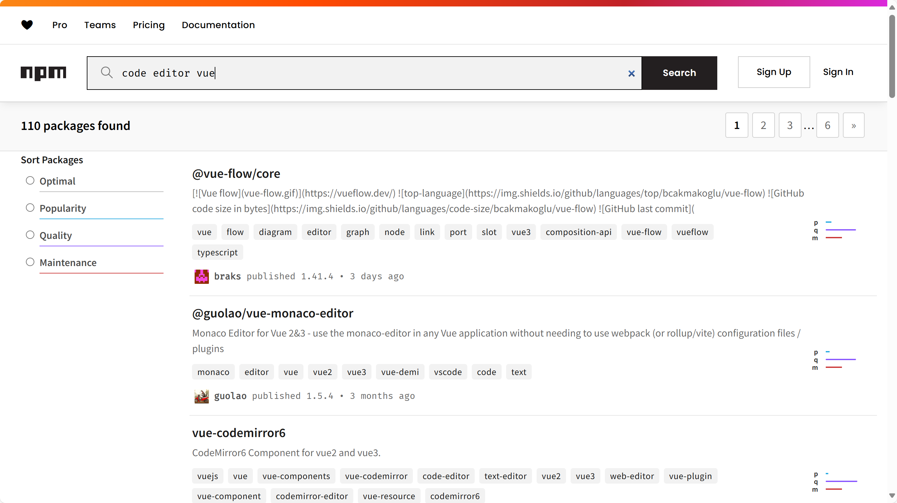

# 如何阅读文档？

## 前言

看到这个标题，你可能会想：

> 我为什么要阅读文档？

> 我为什么要学习如何阅读文档？

> 阅读文档真的需要技巧吗？

### 文档阅读的必要性

在计算机领域，大量的一手信息都隐藏在文档中。任何良好维护的软件项目都会提供文档，以帮助用户更好地理解和使用软件。

也许你已经习惯了遇到问题百度一下，或者在 CSDN（~~Copy，Steal，pay to Download and Not work~~，要打过来就去找 @shenmo）上寻找解决方案。

::: info 立体防御（叠甲）
CSDN 一直是我们（指 [GXDE OS](https://www.gxde.top) 项目组）的良好合作伙伴，非常感谢 CSDN 与华为云联合创建的 GitCode 为我们提供了构建服务（我们也是 GitCode G-Star 开源摘星计划项目）。

但 CSDN 上的文档质量良莠不齐，抄袭甚至互相抄袭重复搬运现象严重，文章的时效性也很差，这也是现实存在的问题。
:::

当然首先，CSDN 上也有很多优秀的文章，同时这些文章某种程度上也是一种文档，但下面的一个例子可能会让你意识到文档，特别是来自项目维护者的**官方文档**的重要性。

下面是一位大四学长向我咨询前端问题的聊天记录：

> 我这边在做数据集管理这部分，需要提供一个编辑SQL语句的文本域，并提供高亮功能，我在网上看到一个叫vue-codemirror的库，安装后按网上的方法去做，会在import语句报错

下面是学长给我的报错的代码：

```JavaScript
import "codemirror/theme/ambiance.css";
import "codemirror/lib/codemirror.css";
import "codemirror/addon/hint/show-hint.css";
let CodeMirror = require("codemirror/lib/codemirror");
require("codemirror/addon/edit/matchbrackets");
require("codemirror/addon/selection/active-line");
require("codemirror/mode/sql/sql");
require("codemirror/addon/hint/show-hint");
```

实际上我看到的时候内心是……今年是2024年啊，这都什么老古董的写法了，一看就是2019年的代码，现在谁还用 `require` 啊，都是 `import` 了。

而且这导入路径也太奇怪了，`codemirror` 是库名，为啥会写成 `require("codemirror/lib/codemirror")` 这种形式。

我当即让学长发我他使用的库的项目主页（但这个要求被忽略了）。

我一边等着学长给我回复，一边在 npm 上搜索 [`vue-codemirror`](https://www.npmjs.com/package/vue-codemirror)，然后我一看文档……人作者给的例子也不长这样啊。

```JavaScript
import { Codemirror } from 'vue-codemirror'
import { javascript } from '@codemirror/lang-javascript'
import { oneDark } from '@codemirror/theme-one-dark'
```


我把官方文档的例子发给学长，然后收到了这样的回复：

> 额额我看的这个

> 那个文档我之前不知道，我去试试

> 行吧，之前遇到问题都是看CSDN的，没看到这个文档，我去看看文档

然后这是他看的那篇 CSDN 文章[《vue实现sql高亮,格式化,自动匹配大小写功能》](https://blog.csdn.net/Aoutlaw/article/details/121204575)：


……先不吐槽这个标题，我点进去一看，好家伙，2021 年的文章，先不说这文章本身的质量好坏吧，三年前 Vue 3 才刚发布，我在 npm 上看了下 `vue-codemirror` 的历史版本，2021 年人家还不支持 Vue 3 呢。

这上哪能跑通啊。

实际上按照正常的检索流程，应该先[在 npm 上搜索 `code editor vue`](https://www.npmjs.com/search?q=code%20editor%20vue)，了解下有哪些库支持 Vue，然后点进项目主页查看文档用法、更新时间、维护情况、依赖兼容性，综合判断应当使用哪个项目来实现。



在一般流程下，这位学长从一开始就不会遇到这些麻烦。即使个别库的文档写得不太好……为什么不换一个库呢？

他文档写得不好活该没人用，终端开发者才是库开发者的用户，终端开发者没有选择这个库，是库开发者的损失。

除此以外，大量编程语言、框架都会维护一份带有教程的官方文档，这些文档通常是库使用者最权威、最全面、最准确的资料。获取这些一手信息，是学习新技术最快的方式。

~~当然，还有一个重要原因，本指南也是文档。~~

### 文档阅读的技巧

正如 2024 年初小米 SU 7 发布时流行的那句话——「好的设计总是心有灵犀」，好的文档也是心有灵犀的。

在文档编写中，通常会遵循一些最佳实践，这些最佳实践在文档中体现为一些约定俗成的规范或者说默契。

~~本指南同样遵循这些最佳实践。~~

阅读文档时，如果能意识到这些最佳实践，就能更快更好地理解文档内容。

下面将以我的个人经验，介绍一些阅读文档的技巧。

## 链接

在文档中，往往会包含大量的链接，这些链接会指向与文档相关的各种资源。

了解这些链接的用途和类别，有助于更好地理解文档内容。

### 外部链接

也许你在阅读本文档时，也会注意到类似这样的链接：[HITCSBasicGuide - GitHub](https://github.com/jiwangyihao/HITCSBasicGuide)。

这个链接的右边有一个小箭头 `↗`，这意味着：

1. 这是一个外部链接，点击后会离开本网站。
2. 这个链接指向资源的创建与维护均与本项目无关，本项目不对其内容负责，也不保证你在点击后能顺利访问到目标资源。
3. 点击这个链接的**代价**比较高，请谨慎点击。

::: tip
不是所有网站都使用相同的图标来标识外部链接，但通常会有类似的标记。
:::

### 术语链接

在许多文档（特别是大型项目）中，会使用一些术语来指代特定的概念或组件。

这些术语通常会被使用加粗、斜体、下划线、代码块等方式加以强调，许多文档（比如 MDN）会为这些术语添加超链接，指向其定义。


比如上图中的`元素`和`标签`，就是两个术语，点击后会跳转到其定义。


也许有个小小的类比会让这种链接的作用更形象：

> 在阅读英文书籍的时候，如果在遇到陌生单词时能一键跳转词典释义，一定很方便吧？

术语链接的作用与此类似。

### 我应该/需要打开文档中的所有链接吗？

绝不！除非文档中明确指出需要点击一个链接，否则在你没有感到困惑的时候，没有任何必要去点击一个链接。

事实上，频繁点击链接跳出，会极大地影响阅读体验。

## Work in Progress

::: danger 注意
此页面尚未完工，欢迎您加入贡献。GitHub 地址：https://github.com/jiwangyihao/HITCSBasicGuide

您也可以点击页面底部的「在 GitHub 上编辑此页面」前往 GitHub 查看对应文件。
:::
