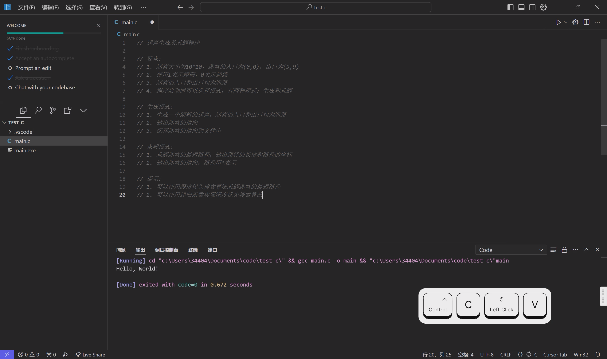
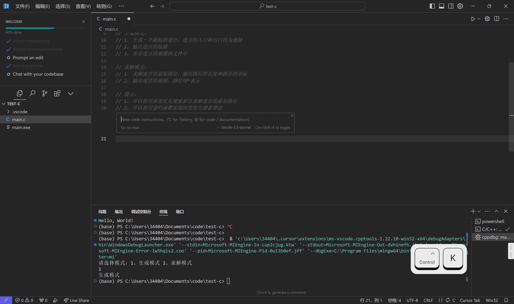
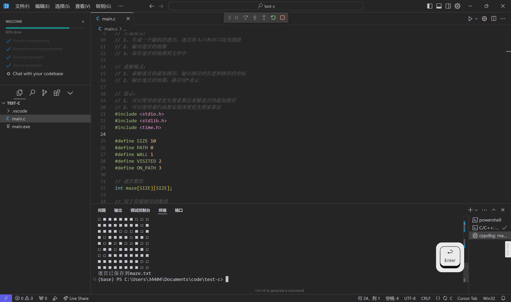
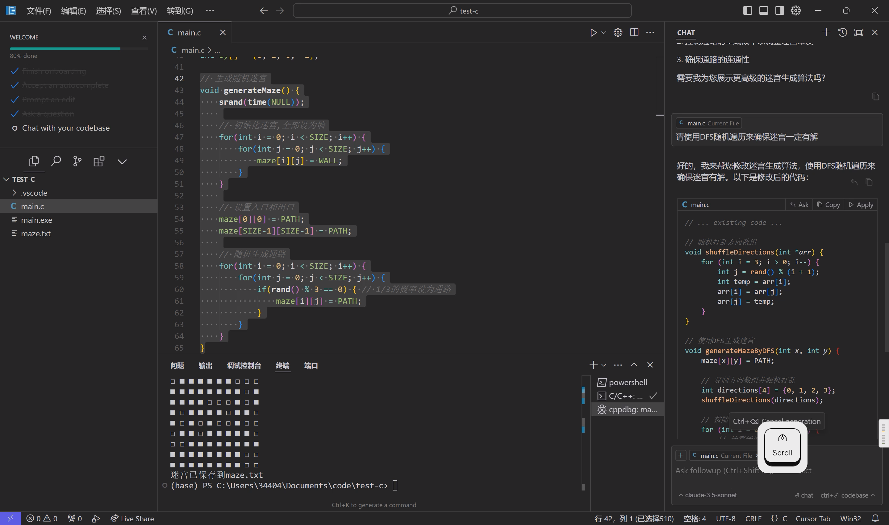

# Cursor 安装指南 & 完成一个简单程序

::: info
本文档将指引你完成 Cursor 的安装、配置和使用。并通过一个简单的示例程序，带你体验 Cursor 的基本功能。
:::

## 视频演示

### Cursor

<video src="./cursor-install/cursor.mp4" controls></video>

### GitHub Copilot in Visual Studio Code

::: info
尽管已经放弃了插件型 AI 辅助编程工具的介绍（

但是我不服，一定要证明一下，那些插件不行只是国内的模型不行（

不是插件这种形式不行（（（
:::

<video src="./cursor-install/copilot.mp4" controls></video>

## 安装 & 配置

1. 访问 [Cursor 官方网站](https://www.cursor.com/)，点击`Download for Free`。

    

2. 打开下载的安装包，按照提示完成安装。

3. 参考 [Visual Studio Code - 配置](../../tool-basic/code-editor-ide/vscode#%E5%AE%89%E8%A3%85-mingw)及后文的示例程序，完成开发环境配置。

## 示例程序

### 需求说明

新建一个 C 语言程序项目，在 `main.c` 前用注释描述程序的功能。

迷宫生成及求解程序

要求：
1. 迷宫大小为10*10，迷宫的入口为(0,0)，出口为(9,9)
2. 使用1表示障碍，0表示通路
3. 迷宫的入口和出口均为通路
4. 程序启动时可以选择模式，有两种模式：生成和求解

生成模式：
1. 生成一个随机的迷宫，迷宫的入口和出口均为通路
2. 输出迷宫的地图
3. 保存迷宫的地图到文件中

求解模式：
1. 求解迷宫的最短路径，输出路径的长度和路径的坐标
2. 输出迷宫的地图，路径用*表示

提示：
1. 可以使用深度优先搜索算法求解迷宫的最短路径
2. 可以使用递归函数实现深度优先搜索算法

### 生成代码

一般来说，我们有两种常见的方式使用 AI 辅助编程工具生成代码：

1. 使用注释描述功能，随后使用 AI 辅助编程工具的`自动补全`功能生成代码。这种方法适合于对代码逻辑有一定了解的开发者，在开发过程中自然利用 AI 能力，也可以在生成过程中及时纠正。这种方法更适合简短的代码片段，而不是完整的程序。
2. 使用 AI 辅助编程工具的 `chat` 功能，与 AI 交流需求，AI 一次性生成完整代码。

在本示例中，推荐使用第二种方法生成代码。

在 Cursor 中，点按快捷键 `Ctrl + K` 启动行内对话，输入「按要求实现程序」，按 `Enter` 启动生成。

### 调试检查

在生成代码后，尝试运行程序，验证程序功能。

当发现程序运行与预期不符时，可以通过 `Ctrl + L` 启动对话面板，向 AI 询问问题原因，征求修改建议。

重复上述步骤，直至程序运行正常。

::: tip Congratulations!
通过本文档，你已经完成了 Cursor 的安装、配置和使用，并通过一个简单的示例程序体验了 Cursor 的基本功能。
:::