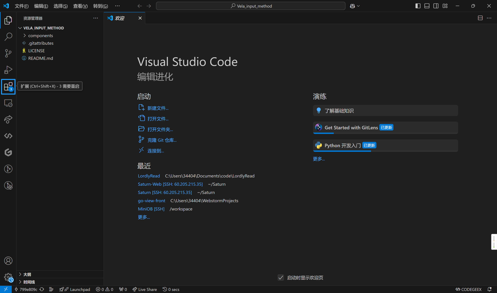
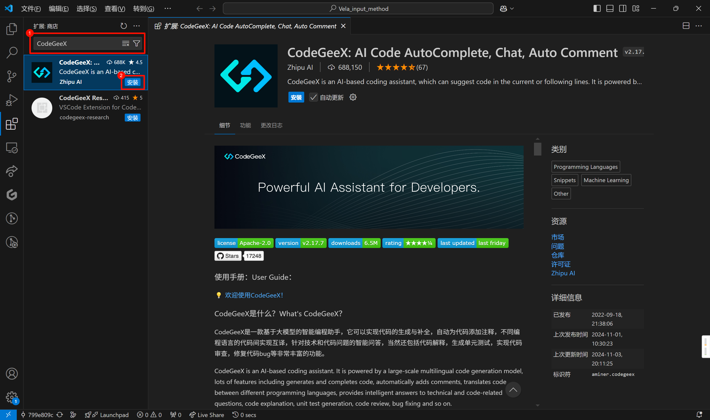
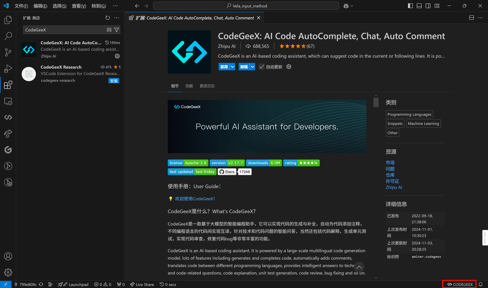
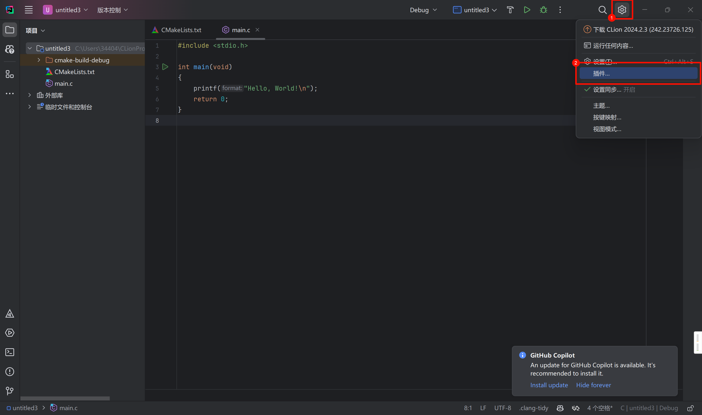
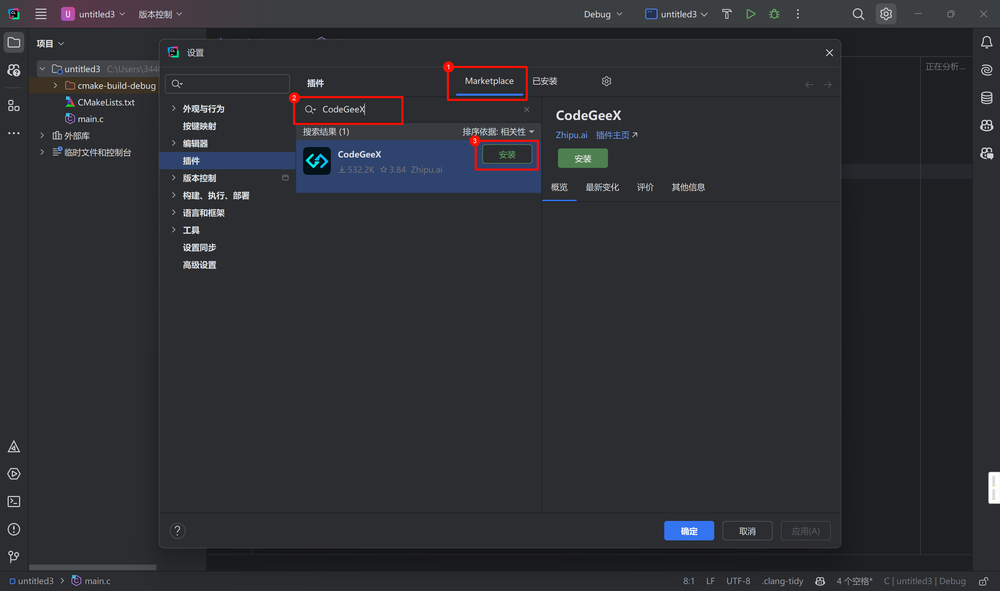
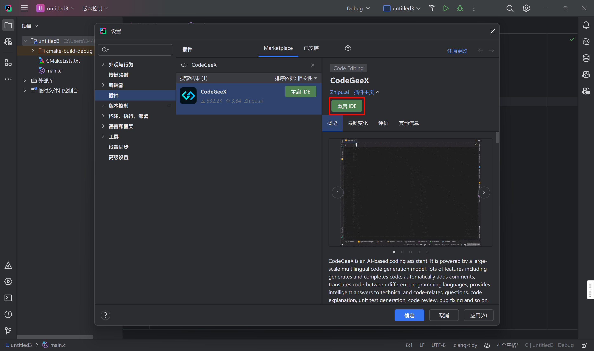
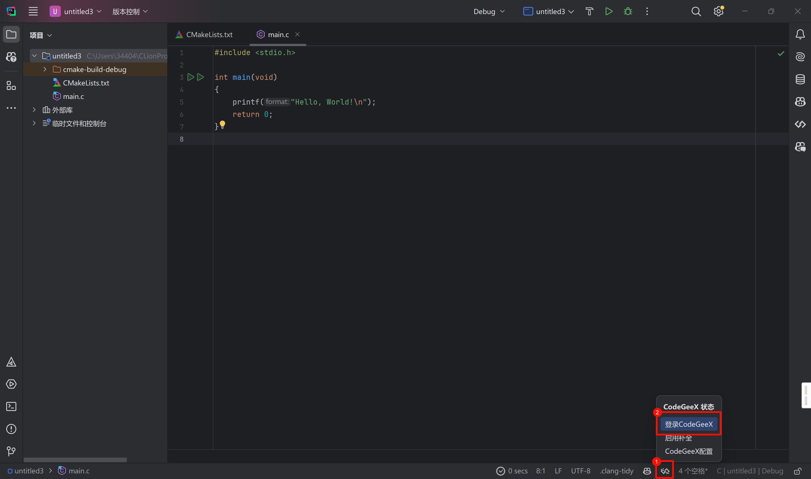

# 插件型 AI 辅助编程工具安装指南

::: warning
实际上笔者目前并不推荐 CodeGeeX，如果你无法申请 GitHub Copilot 学生认证，请考虑使用 Cursor。
:::

::: info
本文档将以 CodeGeeX 为例，指引你完成插件型 AI 辅助编程工具的安装、配置和使用。
:::

::: tip
本教程基于前文推荐的代码编辑器/IDE [Visual Studio Code](../../tool-basic/code-editor-ide/vscode) 和 [JetBrains IDEs](../../tool-basic/code-editor-ide/jetbrains) 展开。

如果你还没有安装 Visual Studio Code 和 JetBrains IDEs 中的其中一个，请参考上述链接完成安装。
:::

## Visual Studio Code

### 安装

1. 打开 Visual Studio Code，点击侧边栏的扩展图标。

   

2. 搜索 `CodeGeeX`，点击安装。

   

### 登录

1. 安装完成后，点击底栏的 `CodeGeeX` 图标，登录 CodeGeeX 账号。

   

2. 在弹出的浏览器窗口中完成登录。

   

## JetBrains IDEs

### 安装

1. 打开 JetBrains IDEs（你所安装的其中一款，比如 CLion），点击右上角的 `⚙️`->`插件`

   

2. 在 `Marketplace` Tab 中搜索 `CodeGeeX`，点击安装。

   

3. 安装完成后，点击`重启 IDE`。

   

### 登录

1. 重启 IDE 后，点击底栏的 `CodeGeeX` 图标 -> `登录 CodeGeeX`，登录 CodeGeeX 账号。

   

2. 在弹出的浏览器窗口中完成登录。

   
