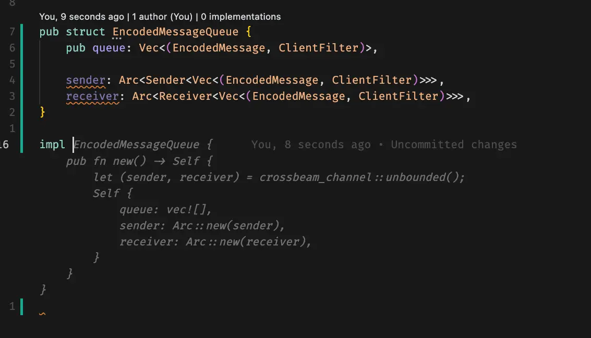
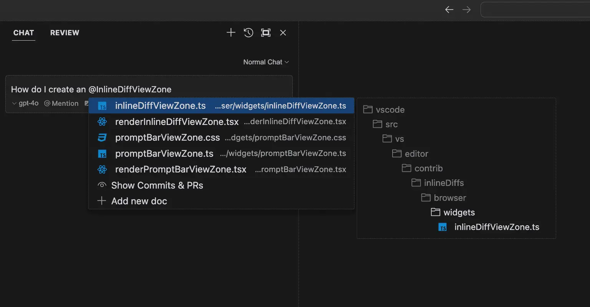
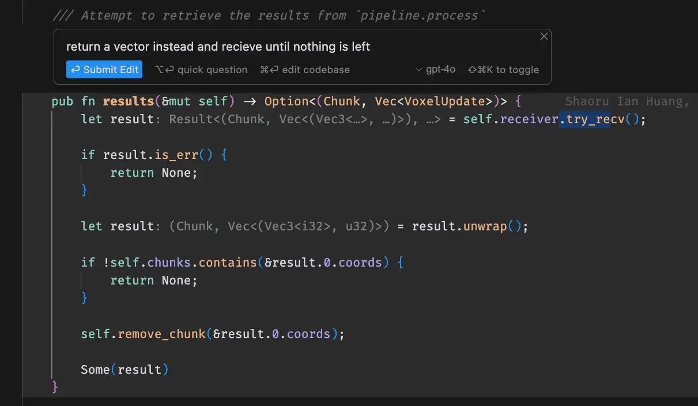
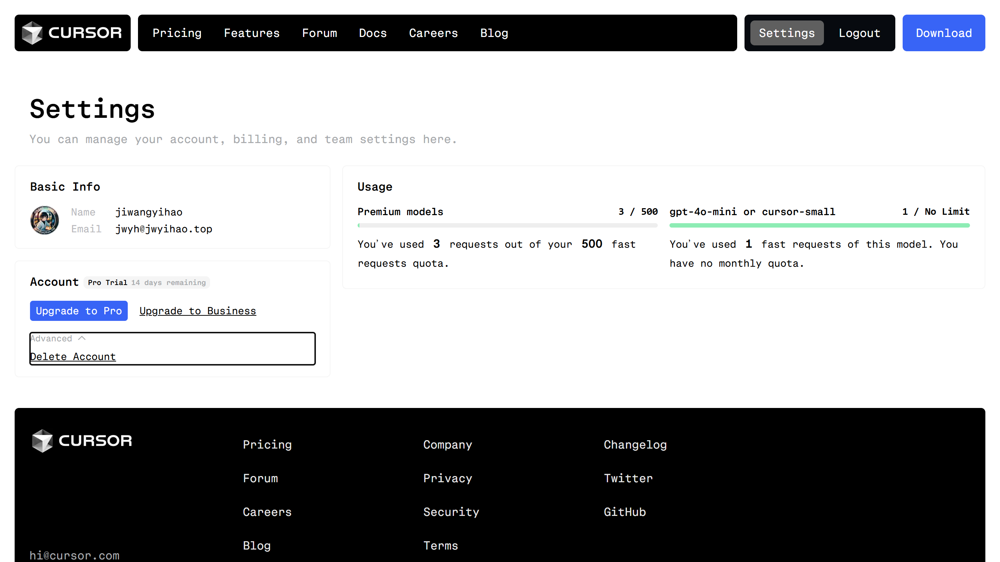

# Cursor 常用功能使用指南

## 自动补全

Cursor 的自动补全功能类似于 GitHub Copilot，可以根据上下文自动补全代码。不同的是，Cursor 的自动补全功能更加智能，可以根据上下文理解你的意图，提供更准确的补全建议。

### 触发方式

1. 自动触发：在编写代码时，Cursor 会自动分析上下文并提供补全建议
2. 手动触发：按下 `Tab` 键可以手动触发补全

### 使用技巧

1. **编写注释**：在代码前添加清晰的注释，可以帮助 Cursor 更好地理解你的意图
2. **逐步补全**：对于复杂的代码，可以先写出框架，然后逐步使用补全完善细节
3. **多方案选择**：Cursor 通常会提供多个补全方案，你可以使用方向键选择最合适的一个

::: tip
如果自动补全的代码不符合预期，可以按 `Esc` 键取消补全，重新输入或尝试其他方案。
:::

### 部分采纳

有时候 Cursor 提供的补全建议可能部分符合你的需求，但不是完全符合。这时你可以接受部分补全：按下 `Ctrl + ->` 键接受当前建议的一部分

这种灵活的使用方式可以帮助你更高效地编写代码，同时保持对代码的完全控制。

::: tip
善用部分采纳功能可以显著提高编码效率，因为它让你能够在 AI 建议的基础上快速调整和完善代码。
:::

::: warning
部分采纳功能需要在设置中开启。
:::

## 窗口对话

Cursor 提供了强大的聊天对话功能，你可以通过对话的方式与 AI 助手交互，获取编程帮助。

### 打开聊天窗口

你可以使用快捷键 `Ctrl + L` 打开聊天窗口。

### 常用对话场景

1. **代码解释**：询问特定代码段的功能和原理
2. **问题诊断**：描述你遇到的问题，AI 会帮助分析并提供解决方案
3. **代码优化**：请求 AI 审查你的代码并提供改进建议
4. **功能实现**：描述你想要实现的功能，AI 会提供相应的代码示例

::: tip
提问时尽量详细描述你的需求和上下文，这样可以获得更准确的回答。
:::

### 使用技巧

1. **选中代码提问**：可以选中特定代码段后再打开聊天窗口，AI 会自动关注这段代码
2. **分步骤提问**：对于复杂问题，可以将其分解成多个小问题逐步解决
3. **保存对话**：重要的对话内容会自动保存，可以在历史记录中查看

### 采纳对话

在对话中，AI 可能会提供代码片段或解决方案。你可以：

1. **直接复制**：点击代码块右上角的 `Copy` 按钮
2. **插入到编辑器**：点击代码块右上角的 `Apply` 按钮，cursor 会自动判断需要的修改
3. **部分采纳**：手动选择并复制你需要的部分

::: warning
插入代码后记得检查其正确性，并根据需要进行适当的调整。
:::

## 行内对话生成

行内对话生成是 Cursor 的另一个重要功能，它允许你在编辑代码时与 AI 助手交互，并允许 AI 助手直接在代码中进行修改。

### 触发方式

1. 按下 `Ctrl + K` 触发行内对话
2. 选中代码后按下 `Ctrl + K` 针对选中内容进行对话
3. 在代码中直接输入 `//` 或 `#` 开始注释,然后描述需求

### 常见使用场景

1. **代码重构**: 描述重构需求,AI 会直接修改代码
2. **功能增强**: 说明需要添加的新功能,AI 会在合适位置插入代码
3. **bug修复**: 描述问题,AI 会分析并修改有问题的代码
4. **代码生成**: 通过自然语言描述来生成新的代码块

::: tip

- 使用自然语言描述你的需求,AI 能更好地理解意图
- 可以分步骤提出修改要求,逐步完善代码
- 修改后记得检查代码的正确性
  :::

### 使用技巧

1. **上下文关联**: AI 会自动分析当前文件的上下文,所以无需重复已有信息
2. **精确定位**: 可以选中特定代码块后再触发对话,使修改更精准
3. **分步修改**: 对于复杂的修改,建议分多个小步骤完成
4. **实时预览**: 修改建议会直接显示在编辑器中,方便确认

::: warning
使用行内对话生成功能时,建议:

- 及时保存重要的代码版本
- 仔细检查 AI 生成的代码是否符合项目规范
- 对于关键修改先在测试环境验证
  :::

## 对话信息补充

在 Cursor 的 AI 输入框中，你可以使用 @ 符号来引用上下文信息。

### 触发方式

1. 在 AI 输入框中输入 `@` 符号
2. 会弹出建议菜单，自动根据你的输入筛选最相关的建议

### 常见使用场景

1. **引用文件**: 输入 `@` 后可以选择工作区中的文件
2. **引用代码片段**: 可以引用特定的代码片段进行讨论
3. **引用上下文**: 引用之前的对话或相关信息
4. **启用 Web 搜索**: 输入 `@web` 后可以启用 Web 搜索
5. **引用文档**: 使用 `@库名` 引用常用库，或使用 `@Docs → Add new doc` 添加新文档

### 使用技巧

1. **键盘导航**: 使用上下方向键浏览建议列表
2. **快速选择**: 按 `Enter` 键选择建议项
3. **分类筛选**: 如果选择了类别（如"文件"），建议会自动筛选为该类别下的相关项

::: tip
合理使用 @ 符号可以让 AI 更好地理解上下文
:::

## 模型选择

Cursor 支持多种 AI 模型，可以根据具体需求选择合适的模型。

其中，`gpt-4o-mini` 和 `cursor-small` 这两个模型是 Cursor 的基础模型。根据 Cursor 的模型架构设计，Premium 模型的生成效果更好，但相比基础模型会有一些使用限制。

## 免费额度已用完？

::: warning
以下内容经测试在文档编写时（2024 年 11 月 5 日）生效，但不保证在你阅读文档时依然可用。

同时不保证下面方法不会被官方以某种方式封禁。

2024 年 12 月 19 日更新：

Cursor 官方已经对此方法进行了限制，当前政策为每个设备每 3 个月只能激活 3 次新账户免费试用（与设备绑定，不与账号绑定）。

另，目前 GitHub Copilot 现已支持免费使用，使用政策为每月 2000 条代码建议、50 条 Copilot Chat 消息，支持 Claude 3.5 Sonnet 或 GPT-4o 模型。

可尝试使用 GitHub Copilot 替代 Cursor，安装方法类似 CodeGeeX，详见 [插件型 AI 辅助编程工具安装指南](./plugin-install)。
:::

笔者的账号是使用 GitHub 注册的（理论上来说使用邮箱注册的账号也可以这样操作，但用 GitHub 注册的时候只需要授权，比邮箱注册方便一些）。

### 删除账户

……很惊讶吗？我一点都不惊讶……世界是个草台班子对吧（

1. 访问 [Cursor 官网](https://www.cursor.com/)，点击右上角的 `Settings` 进入账户管理。

   

2. 点击 `Advanced` 展开菜单，点击 `Delete Account` 删除账户。

   

### 重新注册账户并在 Cursor 中重新登录

这个操作不会导致任何本地配置损失（几乎是无痛的），然后你就可以享受新一轮的 14 天 Pro 版试用以及 14 天后免费帐户的 2000 次自动补全和 50 次 Premium 模型请求。

然后……循环往复（

## 小结

Cursor 的 AI 功能非常强大，可以帮助你提高编程效率。

- 自动补全和行内对话生成功能可以显著提高编码速度
- 聊天对话功能可以获取编程帮助,并进行代码审查和优化
- 选择合适的 AI 模型可以获得更好的性能和效果

::: tip
每个人适合的编程方式是不同的，**并非**所有功能都适合你。请根据你的实际需求选择合适的功能。
:::

::: tip Congratulations!
你已经掌握了 Cursor 的 AI 功能使用指南，希望它能帮助你提高编程效率。
:::
