# JetBrains IDEs

::: info
以适用于 C/C++ 的 CLion 为例，本文档将指引你完成 JetBrains IDE 的账号注册、教育许可证申请、安装、配置和使用。
:::

## 注册账号

1. 访问 [JetBrains 官方网站](https://www.jetbrains.com/zh-cn/)，点击右上角的 `👤`。

   

2. 在页面右下角的 `Not registered yet?` 处填入自己的电子邮箱地址，点击 `Sign Up`。

   ::: warning
   特别注意，请**不要**使用学校邮箱注册 JetBrains 账号，受到 10043 限制影响，使用我校邮箱注册的账号会被直接封禁。
   :::

   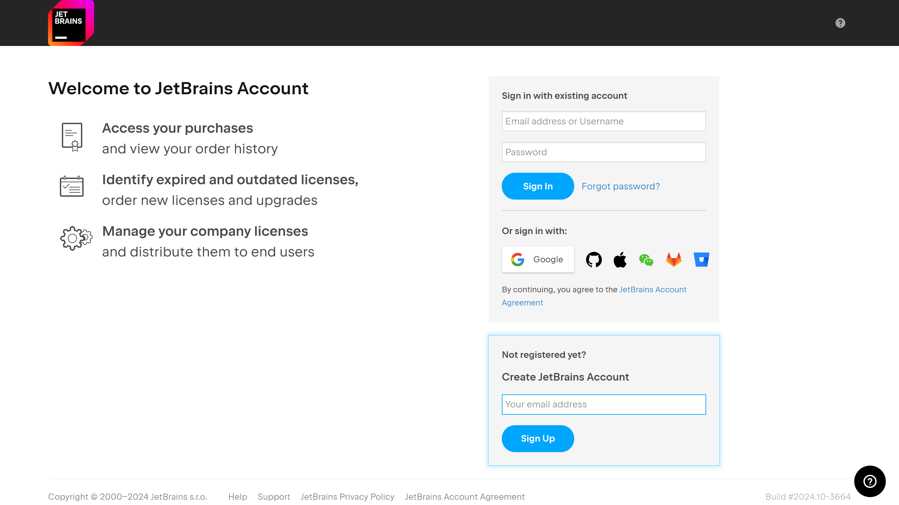

   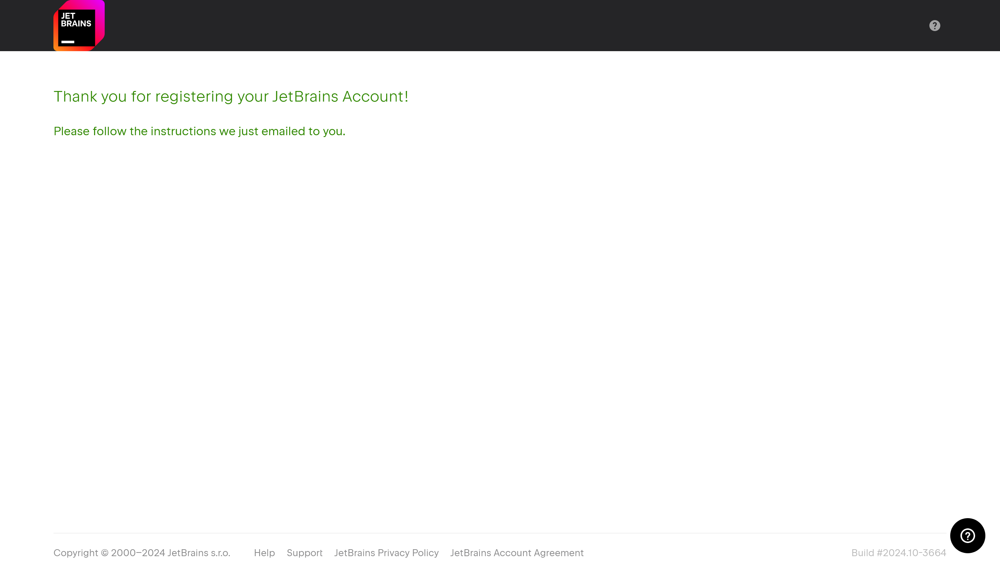

3. 登录邮箱，点击邮件中的 `Confirm your account` 完成注册。

   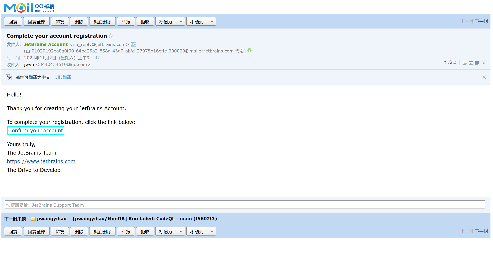

4. 填写个人信息，点击 `Complete` 完成注册。

   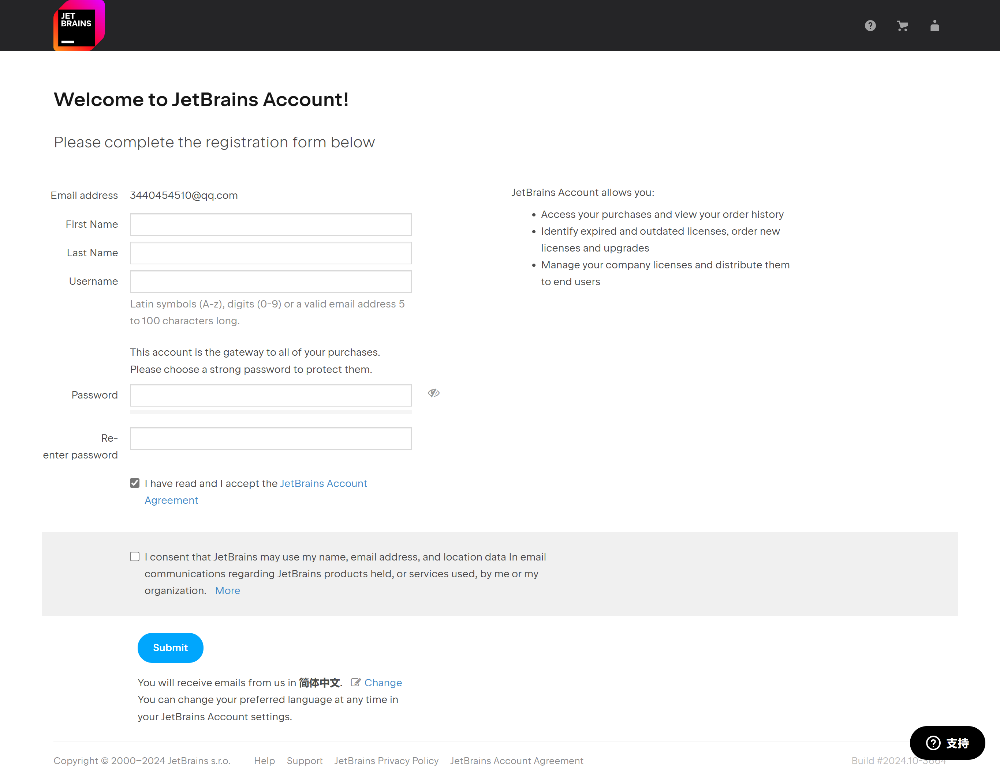

5. 重复[`步骤 1`](#注册账号) 登录 JetBrains 账号，完成登录后你可能会看到如下页面，此时账号内没有许可证是正常的（图中账号申请了一个月的试用，通常许可证审核发放需要一周左右时间，稍后会说明在教育许可证发放之前申请试用的方法）。

   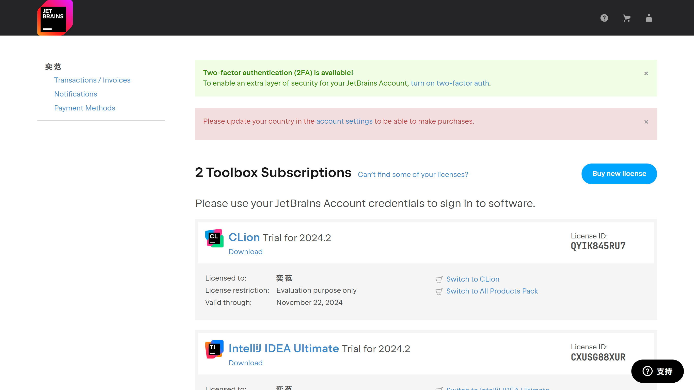

## 申请教育许可证

1. 访问 [JetBrains 官方网站](https://www.jetbrains.com/zh-cn/)，点击顶栏的`教育`->`免费许可证-面向学生和教师`。

   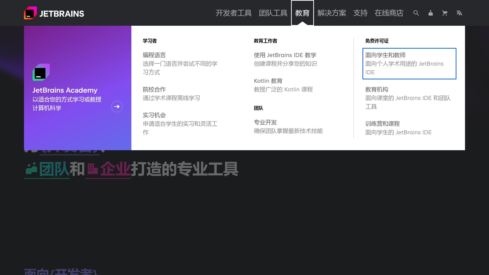

2. 向下滚动页面，点击`立即申请`。

   

3. 在申请方式栏选择`官方文件`，填写表单，随后点击`申请免费产品`。

   ::: tip
   请不要使用学校邮箱，使用个人邮箱申请。

   `官方文件`可以不上传，填写学信网验证码链接即可。

   如果学信网学籍报告还未同步（新生），可以在`官方文件`中上传学生证照片。

   如果学生证还未办理完成（开学前/刚开学），可以在`官方文件`中上传录取通知书照片。
   :::

   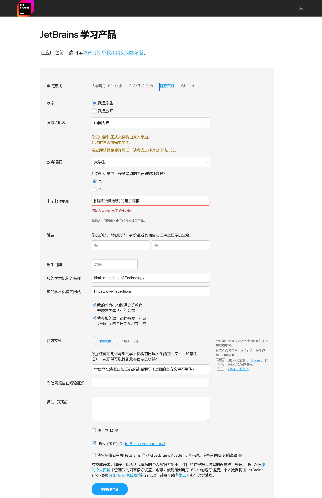

4. 一般来说在一周内，你将会收到 JetBrains 的邮件，告知你的教育许可证是否通过。（如果通过的话）点击 `link your free license` 并登录之前注册的账号，许可证便会自动绑定到账号中。

   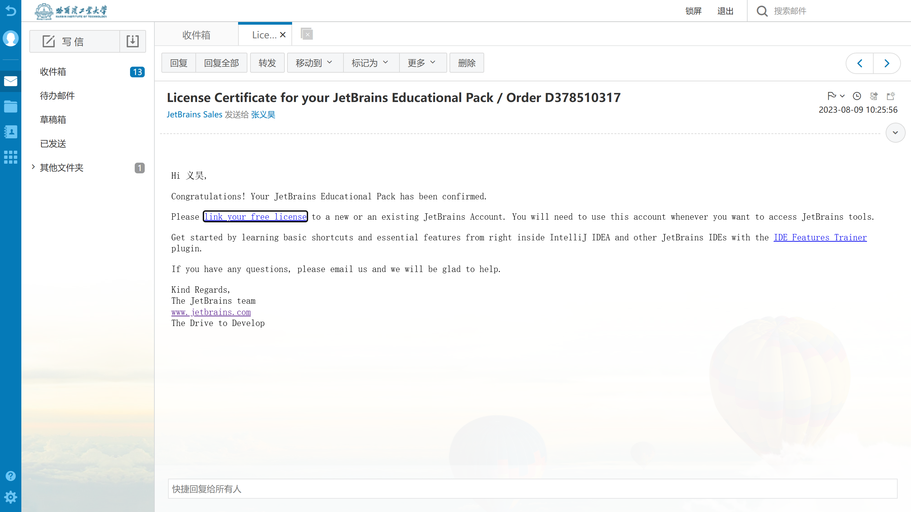

5. 在[许可证管理](https://account.jetbrains.com/licenses)页面看到类似如下图所示的页面，即表示许可证已经绑定到账号中。

   ::: info
   JetBrains 教育许可证包含（除内置 AI 功能外的）全部 JetBrains 产品的 1 年授权，每年可续订一次。

   许可证与账号绑定，如果按照下面教程先申请试用，在试用到期后可能需要在 IDE 中手动更改许可证。
   :::

   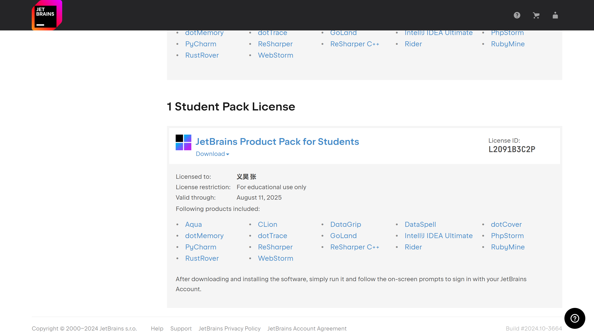

## 安装

### 安装 JetBrains Toolbox

JetBrains Toolbox 是 JetBrains 官方提供的一款软件管理工具，可以方便地安装、升级、卸载 JetBrains 产品。笔者是 JetBrains IDEs 的忠实用户，故推荐使用 JetBrains Toolbox 管理 JetBrains IDE（特别是像笔者一样需要同时使用复数个 JetBrains IDE 的时候）。

1. 访问 [JetBrains 官方网站](https://www.jetbrains.com/zh-cn/)，点击顶栏的`开发者工具`->`Toolbox App`。

   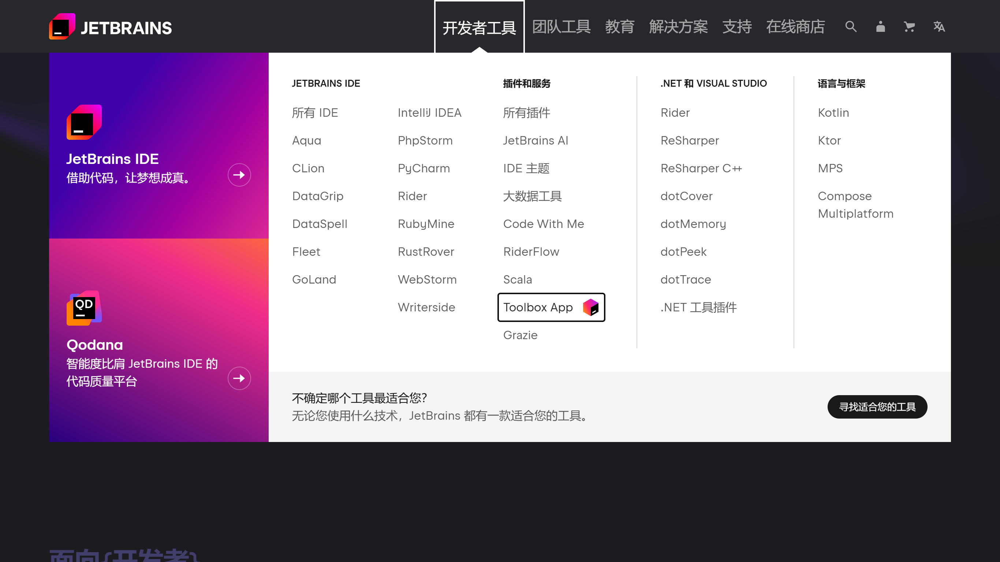

2. 点击`下载`，下载适用于你的操作系统的安装包。

   

3. 安装 JetBrains Toolbox。

4. 打开 JetBrains Toolbox，登录你的 JetBrains 账号。（JetBrains Toolbox 没有桌面快捷方式，可以在开始菜单中找到）

5. 完成登录后，点击 JetBrains Toolbox 右上角的 `⚙️`->`设置`

   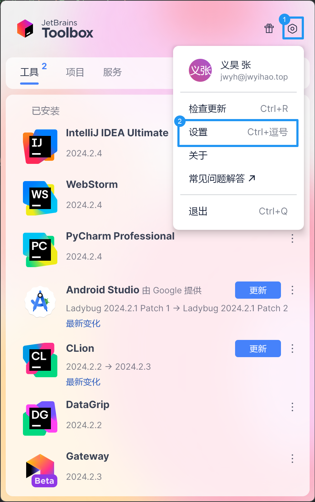

6. 在设置中，可以设置 JetBrains Toolbox 的语言、主题、自动更新等。推荐将语言改为简体中文后勾选下方的`对所有工具使用相同的语言`。

   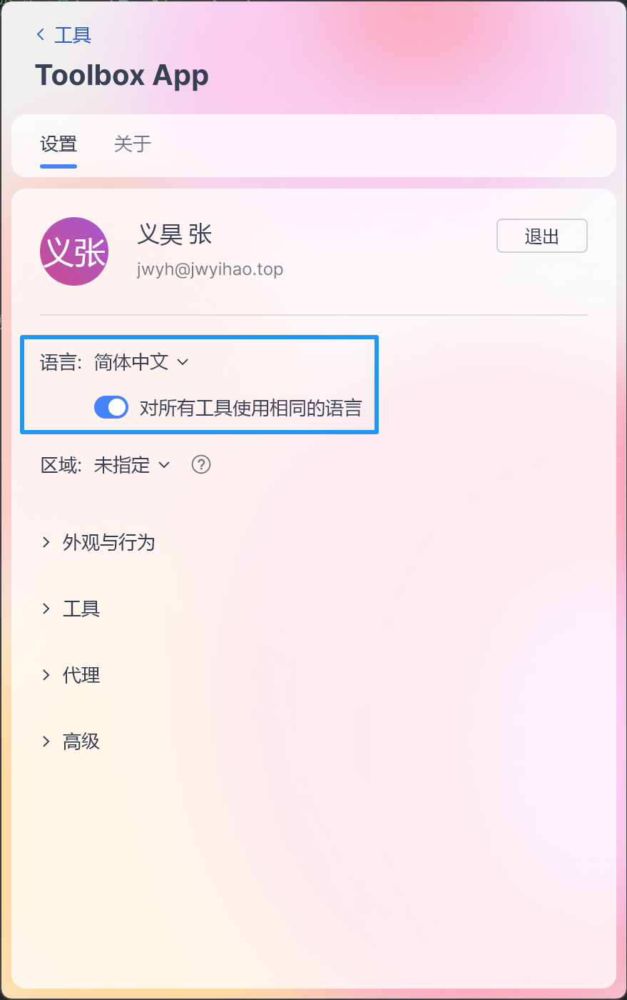

### 安装 CLion

1. 在 JetBrains Toolbox 中下滑找到 `CLion`，点击 `安装`。

2. 安装完成后，默认不会创建桌面快捷方式，可以在 JetBrains Toolbox 中找到 `CLion` 并打开，也可以在开始菜单中找到。

3. 如果启用了`对所有工具使用相同的语言`，CLion 会自动使用简体中文。

## 配置

1. 打开 CLion，初次启动时会提示从其他 IDE/代码编辑器导入设置，可以选择跳过。

2. 新建项目，选择 `C++ 可执行文件`或 `C 可执行文件`（依据实际需求选择），随后选择语言标准并点击创建。（在位置中可以更改项目保存位置及项目名称）

   ::: tip
   不清楚语言标准？对于初学者，可以直接保持默认选项不变
   :::

   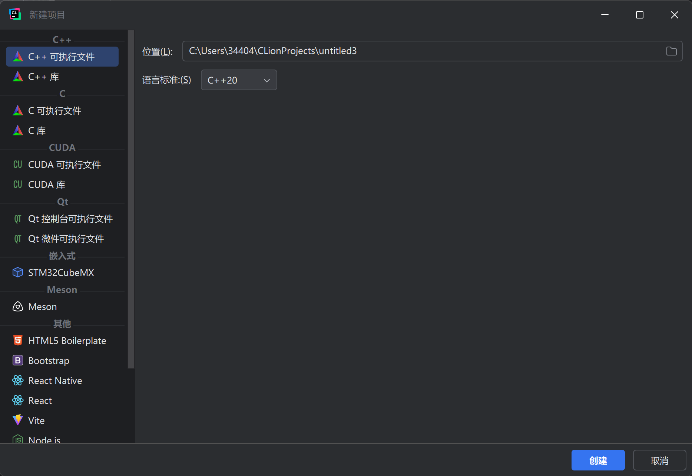

3. 首次创建时会提示配置编译环境，CLion 中有内建的 MinGW 可用，没有特别需求的情况下等待加载完成后点击 `OK` 即可。

4. 写一个 `Hello, World!` 程序，点击右上角的绿色三角形按钮或按下 `Shift + F10` 运行程序。

   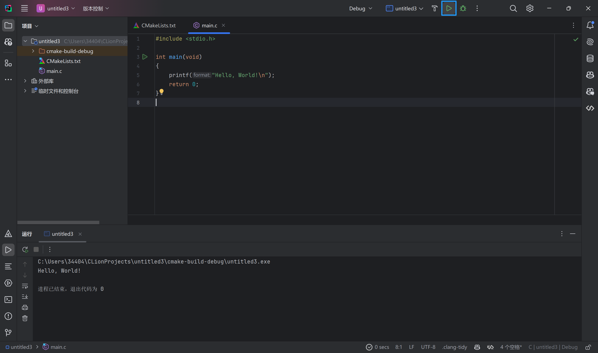

::: tip Congratulations!
你已经成功完成了 JetBrains IDE 的账号注册、教育许可证申请、安装、配置和使用！
:::

## 参考链接

- [JetBrains 官方网站](https://www.jetbrains.com/zh-cn/)
- [JetBrains 教育许可证申请](https://www.jetbrains.com/zh-cn/community/education/#students)
- [JetBrains Toolbox App](https://www.jetbrains.com/zh-cn/toolbox-app/)
- [JetBrains IDEs](https://www.jetbrains.com/zh-cn/products.html)
