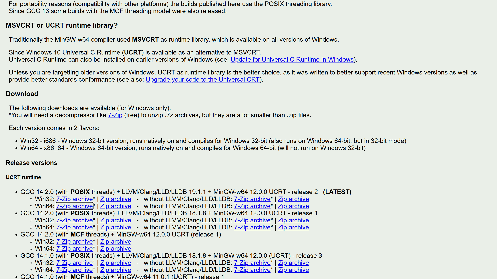
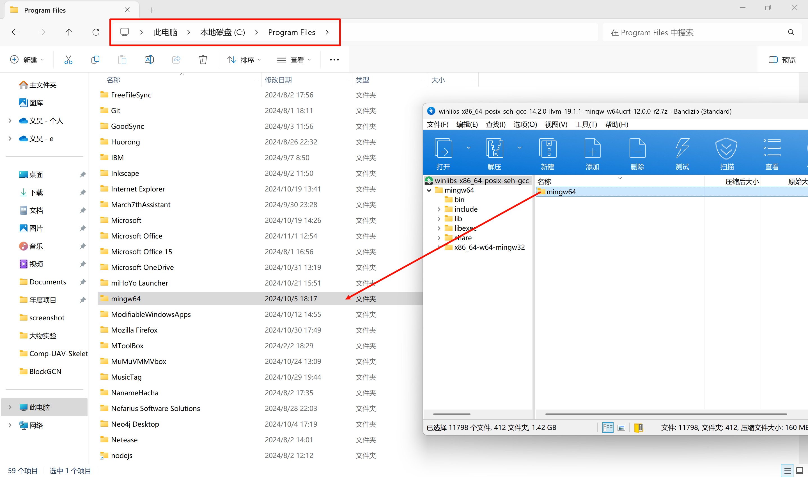
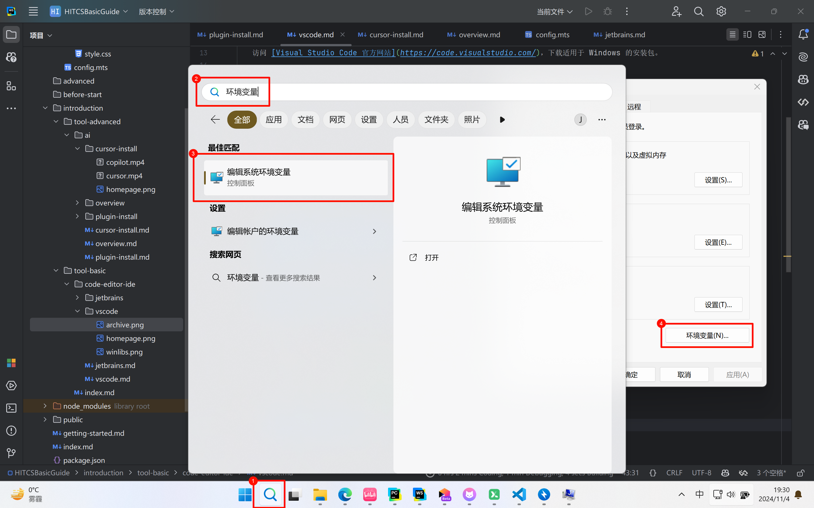
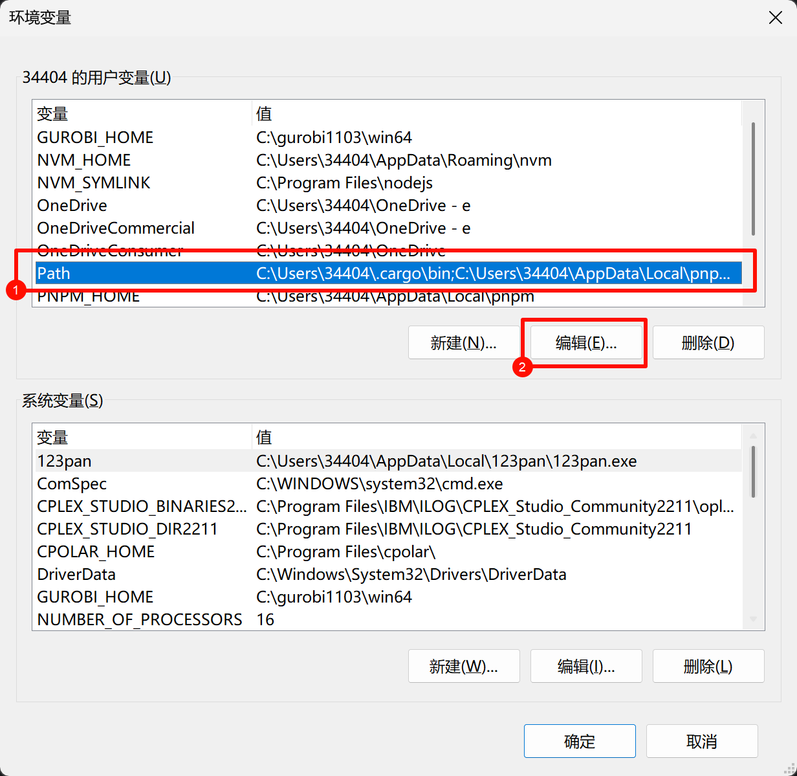
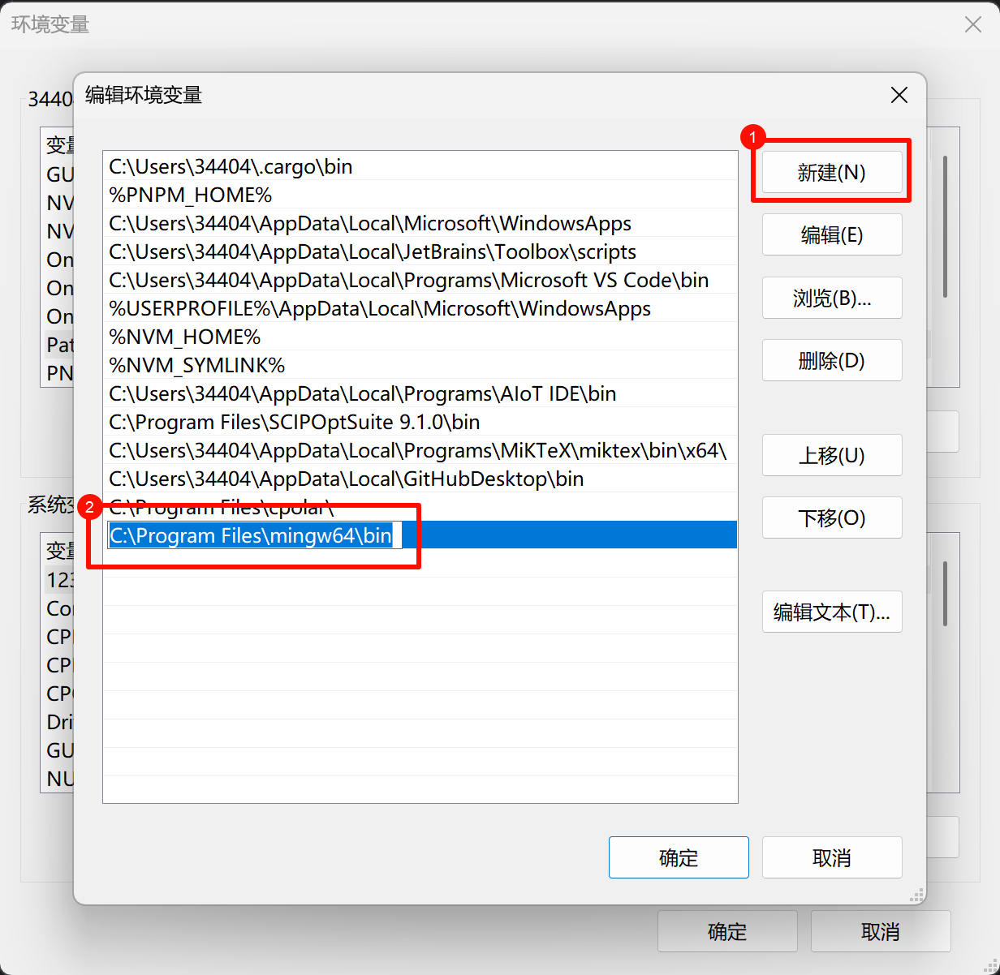
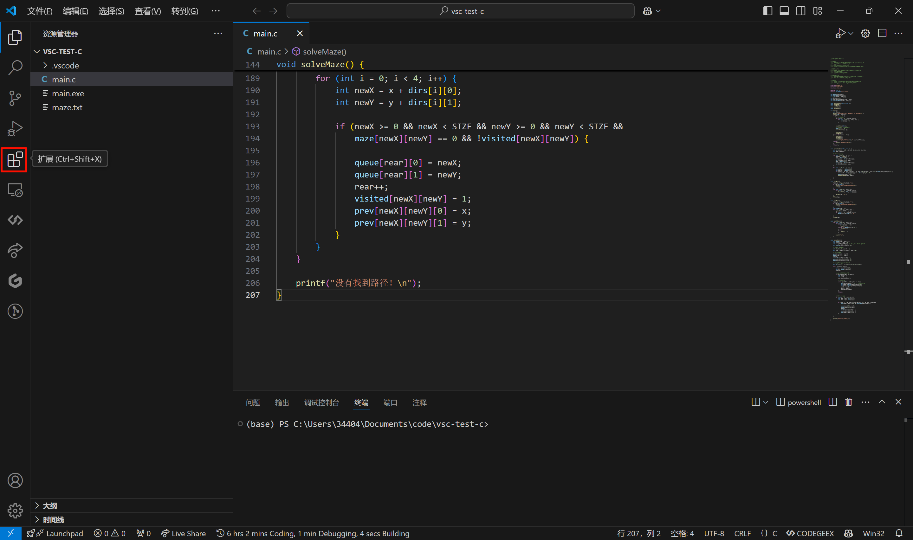

# Visual Studio Code

::: info
本文档将指引你完成 Visual Studio Code 的安装、配置和使用。

以 C 语言环境的配置为例
:::

## 安装（Windows）

1. 下载安装包

   访问 [Visual Studio Code 官方网站](https://code.visualstudio.com/)，下载适用于 Windows 的安装包。

2. 安装

   双击安装包，按照提示完成安装。

3. 打开 VS Code

   在开始菜单中找到 Visual Studio Code 并打开。

## 安装 MinGW

1. 下载安装包

   访问 [WinLibs](https://winlibs.com/)，向下滑动至 Downloads -> Release versions -> UCRT runtimes，下载最新的 Win64 版本。

   

2. 解压至 C 盘根目录或其他你能找到的目录（比如 `C:\Program Files`）。

   

3. 在 Windows 搜索栏中搜索 `环境变量`，点击 `编辑系统环境变量`，在弹出的窗口中点击 `环境变量`。

   

4. 在系统变量中找到 `Path`，点击 `编辑`。

   

5. 点击 `新建`，输入 MinGW 的路径。

   

6. 点击 `确定`，完成 MinGW 的配置。

## 配置

1. 打开 Visual Studio Code，点击侧边栏的扩展图标。

   

2. 搜索 `C/C++ Extension Pack`，点击安装。

3. 搜索 `Code Runner`，点击安装。

## 使用

1. 新建文件

   在 VS Code 中按下 `Ctrl + N`，输入以下代码：

   ```c
   #include <stdio.h>

   int main() {
       printf("Hello, World!\n");
       return 0;
   }
   ```

2. 运行

   按下 `Ctrl + Alt + N` 或点击右上角的 `Run Code` 按钮，查看输出结果。

::: tip Congratulations!
你已经成功完成了 C 语言的 Visual Studio Code 环境配置和使用！
:::

## 参考资料

- [VS Code 官方网站](https://code.visualstudio.com/)
- [VS Code 文档](https://code.visualstudio.com/docs)
- [VS Code 插件市场](https://marketplace.visualstudio.com/vscode)
